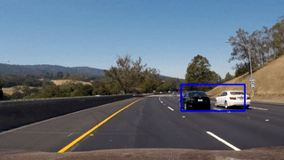

## Vehicle Detection and Tracking (Self-Driving Car Engineer Nanodegree)

This repository contains the code in a form of a Jupyter notebook 
that could be used to detect and track cars on the road. Computer vision techniques are used. There is [`Writeup.md`](./Writeup.md) that summarizes the work done. Training data for vehicles and non-vehicles are available: [vehicles](https://yadi.sk/d/z55uKF-J3KNDgg), [non-vehicles](https://yadi.sk/d/-blY05xV3KNDnV).

Below video is the video showing how the algorithm works.

#### Development Environment
Use `udacity/carnd-term1-starter-kit:latest` docker image to run the code in this repository.
